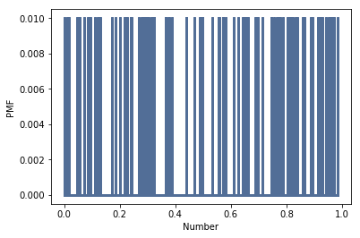
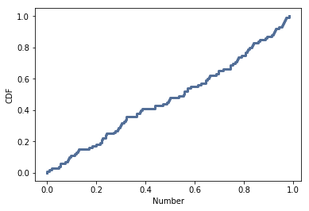

[Think Stats Chapter 4 Exercise 2](http://greenteapress.com/thinkstats2/html/thinkstats2005.html#toc41) (a random distribution)

```python
# Import needed modules
import numpy as np
import thinkstats2
import thinkplot

# Generate 100 random numbers (I used this instead of 1000 since the effect is more obvious this way)
uniforms = np.random.random(size = 100)

uniform_pmf = thinkstats2.Pmf(uniforms)
uniform_cdf = thinkstats2.Cdf(uniforms)

# Plot PMF
thinkplot.Pmf(uniform_pmf)
thinkplot.Config(xlabel = "Number", ylabel= "PMF")
```

```python
# Plot CDF
thinkplot.Cdf(uniform_cdf)
thinkplot.Config(xlabel = "Number", ylabel= "CDF")
```


>> For the PMF, the distribution is noisy so it is hard to tell if it is truly uniform. The CDF shows a linear increase with number, more obviously showing that the distribution is uniform.
